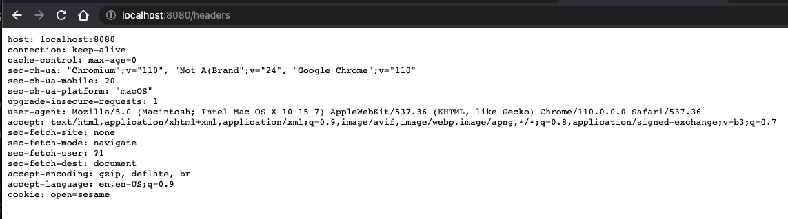

# Headers

Example output of visiting http://localhost:8080/headers with this app is:



This app was created with Bootify.io - tips on working with the code [can be found here](https://bootify.io/next-steps/). Feel free to contact us for further questions.

## Release 0.0.1 the fat jar

Just download release 0.0.1 and run:
```
java -jar headers-0.0.1-SNAPSHOT.jar
```


## Development

During development it is recommended to use the profile `local`. In IntelliJ, `-Dspring.profiles.active=local` can be added in the VM options of the Run Configuration after enabling this property in "Modify options".

Update your local database connection in `application.properties` or create your own `application-local.properties` file to override settings for development.

After starting the application it is accessible under `localhost:8080`.

## Build

The application can be built using the following command:

```
mvnw clean package
```

The application can then be started with the following command - here with the profile `production`:

```
java -Dspring.profiles.active=production -jar ./target/headers-0.0.1-SNAPSHOT.jar
```

## Further readings

* [Maven docs](https://maven.apache.org/guides/index.html)  
* [Spring Boot reference](https://docs.spring.io/spring-boot/docs/current/reference/htmlsingle/)  
* [Spring Data JPA reference](https://docs.spring.io/spring-data/jpa/docs/current/reference/html/)  
